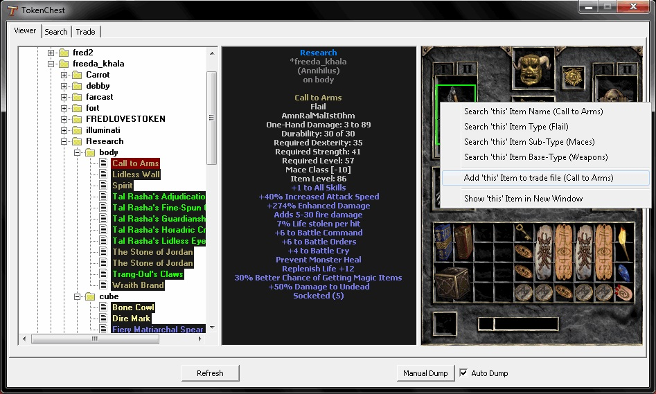

# TokenChest
------------

Works with Dialbo II 1.13d, intended to be used on the Annihilus.net private server, but will work with Vanilla D2. 

This program allows the user to log all of their characters, then look at them while offline. 
It also has built in searching functionality making it extremely easy to count how many of each item you have and where they are.
Also has some experimental code to create lists of items that you have for trade, which you can easilty post and modify. 

Special thanks to r57shell for writing the the character dumping code and releasing it enabling others to expand on it.
Original post: http://www.blizzhackers.cc/viewtopic.php?f=182&t=499536

 
 
 
 